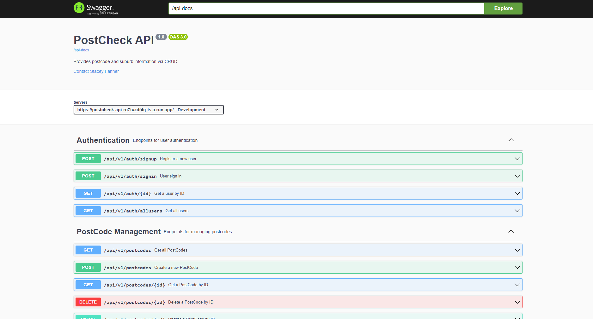
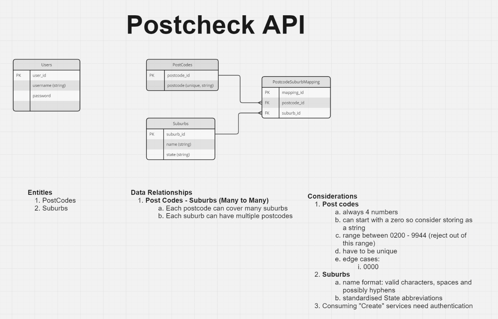

# Welcome to PostChecker-API

A Spring Boot backend powered by SQLite.

<div align="center">
  
</div>

## Build Steps

```bash
1. git clone https://github.com/staceyjf/PostCheck-API
2. cd PostCheck-Api
3. mvn -B package --file pom.xml
4. Add your credential in a .env to connect to a mySQL database. An example env configure can be found at `.env.example`
5. mvn spring-boot:run
6. Run tests: `mvn --batch-mode --update-snapshots verify`
```

## Brief

In this fictional brief, Aus-Post would like to add authentication to their service (in particular for their creating, updating, and deleting functionalities) that provides postcode and suburb information via an API.

The MVP to deliver on this client brief was:

- Create an API in Java that allows clients to retrieve and add suburb and postcode combinations.
- Implement:
  - An API that allows clients to retrieve suburb information by postcode.
  - An API that allows clients to retrieve a postcode given a suburb name.
- A secured API to add new suburb and postcode combinations.
- Some form of persistence (a database).
- Testing for service layers.

PostChecker-API delivers on this and more - check out below.

## Documentation

Explore the Spring API documentation at: `http://localhost:8080/swagger-ui/index.html` with the search term `/api-docs`.

<div align="center">
  
</div>

## Planning

## ERD

Before starting the project, I delved into my planning background to understand the nature of the relationships that exist between my entities (Postcodes, Suburbs, and Users).

As postcodes and suburbs can be associated with many of the other entities, I implemented a join table to ensure that these relationships were correctly managed within the database.

Given the proposed use of the API, I decided to implement a unidirectional relationship with the `Postcode` entity owning the relationship (associated suburbs were only contained on the postcode side). This approach is slightly different from the Flask version of this backend, and it was valuable to explore both options across the different versions.

<div align="center">
  
</div>

## Key Features

### Backend

1. **Implementing JWT Auth:** While a service token might have been more appropriate given the nature of the API, I wanted to explore JWT and how to implement it using Spring Security.
2. **CRUD API Endpoints:** Full CRUD endpoints are provided for the `Postcode` entity. Create, Read, and Update endpoints are also provided for the `Suburbs` and `Users` entities.
3. **API Documentation:** Enhanced use of Swagger to produce more informative documentation on how to use the API.
4. **Flexible Querying:** Clients are able to search for postcodes by suburb and vice versa.
5. **Unit Testing:** Services are tested to ensure that the business logic is properly applied.


## Key Learning Highlights

1. **Managing Auth:** The journey of understanding how authentication is implemented with Spring Security, including:
   - Understanding how HTTP requests are directed, using the `OncePerRequestFilter` interface, and implementing a filter to ensure proper authentication where needed.
   - Setting up how to generate and read a token with the `java-jwt` library, including navigating environment variables using the `@PropertySource` annotation in the configuration class.
   - Using the `UserService` interface when creating my user entity, which is used to store user information in authentication objects.
   - Creating a sign-up endpoint that utilizes `UserDetailsService` and `BCryptPasswordEncoder` to manage users and their password details.
   - Creating a sign-in endpoint that uses the `Authentication` object and additional methods like `UsernamePasswordAuthenticationToken` to authenticate the username and password, and then pass this to our custom Token service to ensure that the token is valid.
2. **Testing:** It was the first time I was using SpringTest and JUnit, so it took some time to get used to the different syntax and functionality each offers. I was able to implement JUnit for unit tests on my service modules but could not get the integration tests to work for my controllers due to the implemented authentication requirements and how JWTs are created and read.

## To-Dos

1. **Orphaned Suburb Entities:** Review the Postcode delete endpoint and introduce functionality to handle orphaned suburb entities.
2. **Documentation:** Improve the documentation by adding content objects to the `@APIResponse` annotations for better visibility into the expectations of a successful or valid HTTP request.
3. **Spring Testing:** Continue to investigate how to use Spring testing effectively and address challenges in providing a valid token (all requests returned 401 or 403 errors, which, in some cases, indicates that authentication is working correctly).

## Changelog

**Date: 21/06/24**

Updates:

1. **Search Improvements:** Enhanced search functionality to accept partial matches for postcode and suburbs.
2. **UI Improvements:** Customized scrollbar added for better consistency with the overall look and feel.

**Date: 22/06/24**

Updates:

1. **Docker Containerization:** Docker containerization for the Spring Boot API and deployment to Google Run. While the backend is deployed, there is an issue with deployment that needs further investigation.

**Date: 25/06/24**

Updates:

1. **React Front-End:** The nested React front-end app has been moved to its own repository at [https://github.com/staceyjf/Postcheck-front](https://github.com/staceyjf/Postcheck-front).

**Date: 27/06/24**

Updates:

1. **Deployment:** Successfully deployed on Google Run. CORS settings in the configuration have been updated with the front-end deployed link.

**Date: 01/07/24**

Updates:

1. **Deployment:** Took down the server as the frontend app is now connected to my Flask backend.

## Technologies Used

<div align="center">


</div>
