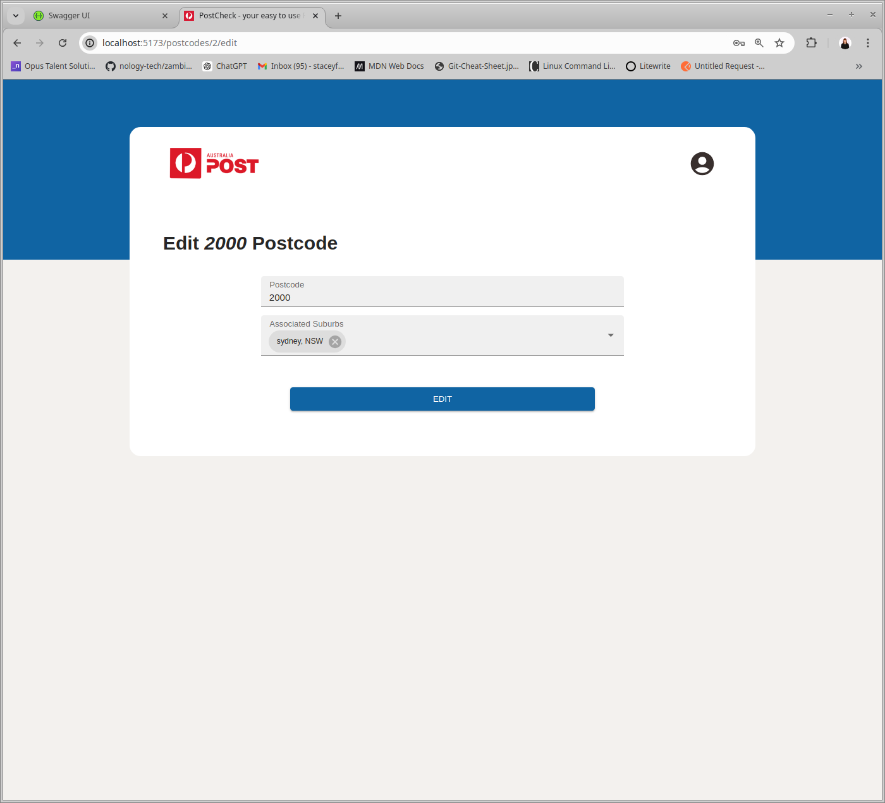
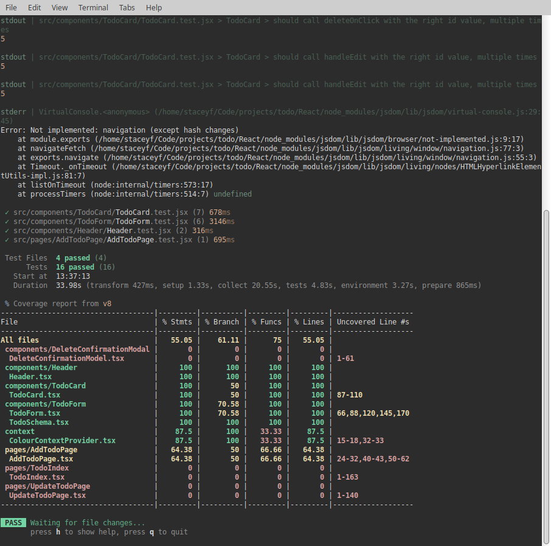

# Welcome to PostChecker-API

A Spring Boot backend powered by SQLite and deployed via Google Run.

  

## Build Steps

1. Clone the repo.
2. Start the Spring Boot backend via `PostcodeApplication.java`.
3. Tests can be run via `src/test/java/com/auspost/postcode`.

## About

In this fictional brief, Aus-Post would like to add authentication to their service (in particular for their creating, updating, and deleting functionalities) that provides postcode and suburb information via an API.

The MVP to deliver on this client brief was:

- Create an API in Java that allows clients to retrieve and add suburb and postcode combinations.
- Implement:
  - An API that allows clients to retrieve suburb information by postcode.
  - An API that allows clients to retrieve a postcode given a suburb name.
- A secured API to add new suburb and postcode combinations.
- Some form of persistence (a database).
- Testing for service layers.

PostChecker-API delivers on this and more - check out below.

Explore the Spring API documentation at: `http://localhost:8080/swagger-ui/index.html` with the search term `/api-docs`.

## Planning

## Design inspriation

Given the fictional brief, I used the existing Aus-post Postcode checker as my design insprration.

  

## ERD

Before starting the project, I lendt into my planning background to understand the nature of the relationship that exist between my entites (PostCcodes, Surburbs and Users). As postcodes and suburbs can contain many of the other entity, I implemented a join table to ensure that they were correctly managed within the DB. Given the proposed use of the API, I decided to implement a uni-directional relationship with the `Postcode` entity owning the relationship (associated suburbs were only contained on the postcode side). If there are additional future user requirements, I can look at changing this to a bi-directional relationship to ensure that each can hold associations of the other.

  

## Key Features

### Backend

1. **Implementing JWT Auth:** While a service token may have been more appropriate given the nature of the API, I wanted to explore JWT and how to implement it using Spring Security.
2. **CRUD API Endpoints:** Full CRUD endpoints are provided for the `Postcode` entity. Create, Read and Update endpoints are provided for the `Suburbs` and `Users` entities.
3. **API Documentation:** Enhanced use of Swagger to produce more informative documentation on how to use the API.
4. **Flexable Quering:** Clients are able to search for postcode by suburbs vice a versa.
5. **Unit Testing:** Services are tested to ensure that the business logic is properly applied.

## Key Learning Highlights

1. **Managing Auth:** The journey of understanding how authentication is implemented with Spring Security, including:
   - Understanding how HTTP requests are directed, using the `OncePerRequestFilter` interface, and implementing a filter to ensure proper authentication where needed.
   - Setting up how to generate and read a token with the `java-jwt` library, including how to navigate environment variables using the `@PropertySource` annotation in the configuration class.
   - Using the `UserService` interface when creating my user entity, which is used to store user information in authentication objects.
   - Creating a sign-up endpoint that utilizes `UserDetailsService` and `BCryptPasswordEncoder` to manage users and their password details.
   - Creating a sign-in endpoint that uses the `Authentication` object and additional methods like `UsernamePasswordAuthenticationToken` to authenticate the username and password, and then pass this onto our custom Token service to ensure that the token is valid.
2. **Testing:** It was the first time that I was using SpringTest and JUnit, so it took some time getting used to the different syntax and functionality each offers. I was able to implement JUnit for unit tests on my service modules but could not get the integrated tests to work for my controllers given the implemented auth requirements and how JWTs are created and read.

## To-Dos

1. **Orphaned Suburb Entities:** Review the Postcode delete endpoint and introduce functionality to deal with orphaned suburb entities.
2. **Documentation:** Improve the documentation by adding content objects to my `@APIResponse` annotations for better visibility into what is expected from a successful or valid HTTP request.
3. **Spring Testing:** Continue to investigate how I can use Spring testing and overcome the challenges in providing a valid token (all requests came back with a 401 or 403, which in some ways is positive as it shows that the auth was correctly working).

Changelog
Date: 21/06/24

Updates:

1. Search Improvements: Enhanced search functionality: Improved search functionality to accept partical matches for postcode and suburbs.
2. UI Improvements: Customised scrollbar add for better consistency with the overall look and feel.

Date: 22/06/24

Updates: 
1. Docker containerization for Spring boot API and deployed to Google Run. While the backend is deployed there is an issue with deployment which needs to be further investigated.

Date: 25/06/24

Updates: 
1. Nested React front app has been moved to its only repo at https://github.com/staceyjf/Postcheck-front

Date: 27/06/24

Updates: 
1. Deployment: Successful deployed on Google Run. Cors settings in webconf have been updated with front end deployed link.

## Screenshots

| New Form                                  | Update Form                                  | Testing -front                         |
| ----------------------------------------- | -------------------------------------------- | -------------------------------------- |
|  |  |  |

## Technologies Used

